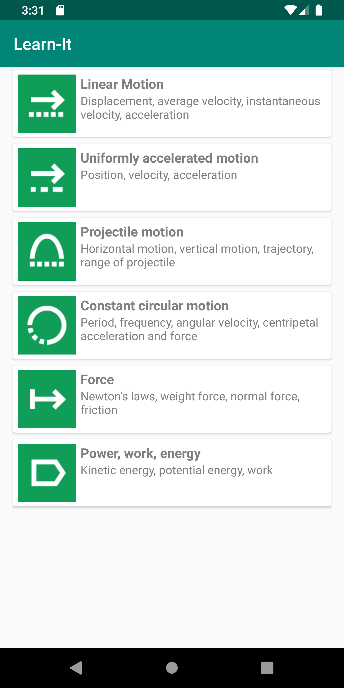
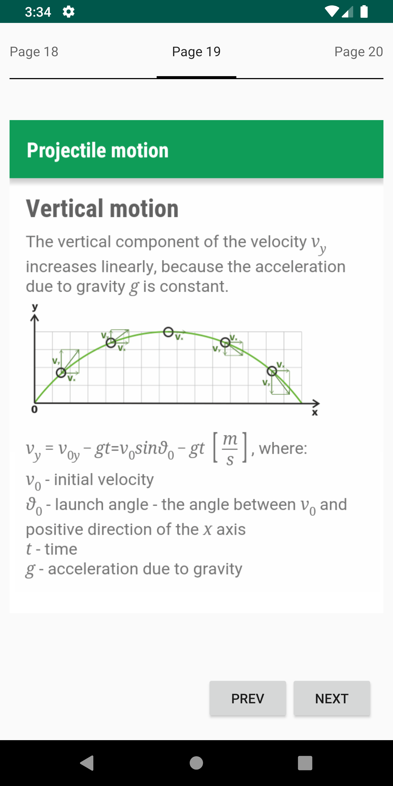
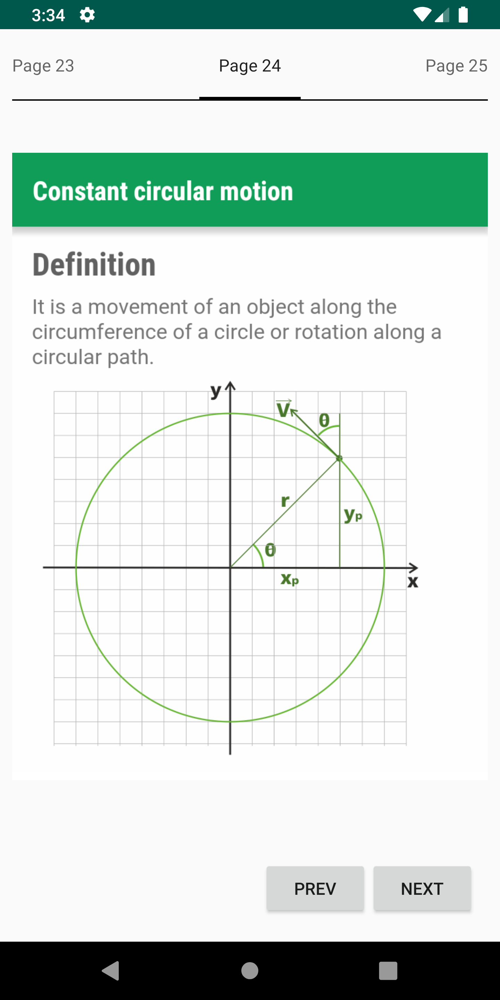

# Learn-It

A simple android app which uses RecyclerView to list physics concepts in cards and ViewPager to show about information about these concepts.

## Getting Started

These instructions will get you a copy of the project up and running on your local machine for development purposes.

### Prerequisites

To install this project you need:

- [Android Studio 3.5+](https://developer.android.com/studio "Android Studio 3.5+") (alongwith Android SDK with Android platform version 24+)
- [git](https://git-scm.com/downloads "git") (only to clone this repository)

### Installation

To set up everything in your local machine, you need to follow these steps:

1. Clone this repo onto your computer:

```bash
$ git clone https://github.com/kaushalmeena/learn-it.git
```

2. Open Android Studio

3. Either press 'Open an Existing Android Studio Project' or click File > Open...

4. Navigate to `learn-it` folder. Press Choose, or OK

## Screenshots

  

## License

This project is licensed under the MIT License - see the [LICENSE](LICENSE) file for details.
